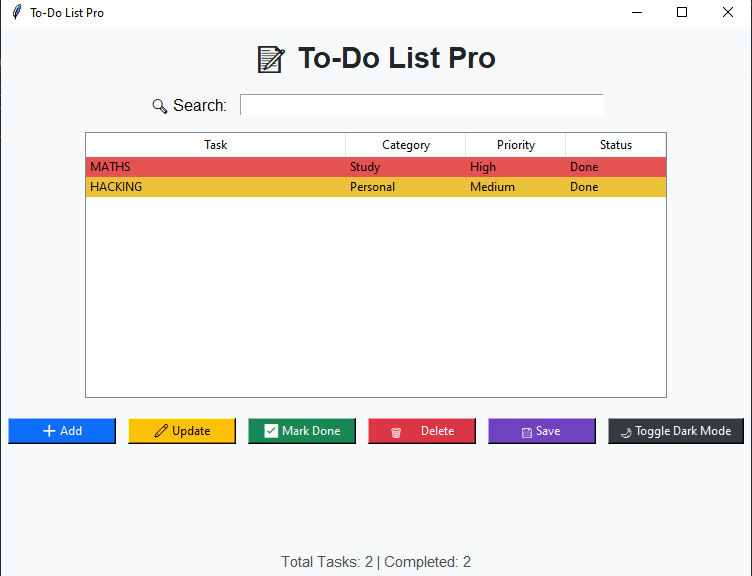

<h1 align="center">  📝 To-Do List Pro </h1>


**Tagline:** Organize, Prioritize, and Conquer Your Tasks 🚀

---

## 📖 Description
To-Do List Pro is a feature-rich task management desktop application built with **Python** and **Tkinter**.  
It allows users to create, categorize, prioritize, search, update, and mark tasks as done — all with a clean, intuitive GUI.  

Tasks are saved automatically to a JSON file for persistence, and you can also export them as a TXT file for sharing or backup.  
The app supports **Dark Mode** for comfortable use in different lighting environments.

---

## ✨ Features
- ➕ **Add Tasks** with category & priority
- 🔍 **Search Bar** to filter tasks instantly
- ✏️ **Update Tasks** directly from the GUI
- ✅ **Mark Tasks as Done**
- 🗑️ **Delete Tasks** with confirmation
- 💾 **Save Tasks to JSON** for persistence
- 📤 **Export Tasks to TXT** format
- 🌙 **Toggle Dark Mode**
- 🎯 **Priority-based Row Highlighting**
  - **High:** Red
  - **Medium:** Yellow
  - **Low:** Green
- 📊 **Live Status Counter** (Total Tasks & Completed Tasks)

---

## 🧰 Tech Stack
| Component | Version |
|-----------|---------|
| Python    | 3.9+    |
| Tkinter   | 8.6+    |
| JSON      | Built-in|
| OS        | Windows, macOS, Linux |

---

## 📁 Project Structure
```
to-do-list-pro/
│
├── main.py        # Main application code
├── tasks.json     # Saved tasks (auto-created)
├── README.md      # Project documentation
└── ScreenShot     # Preview (screenshot)
```

---

## ⚙️ How to Run

### 1. Setup
- Install Python 3.9+ and ensure it’s added to your PATH.
- Tkinter comes pre-installed with most Python distributions. If missing:
  ```bash
  pip install tk
  ```

### 2. Run the Application
```bash
python main.py
```

---

## 🧪 Testing Instructions
1. Launch the app (`main.py`).
2. Add multiple tasks with different categories and priorities.
3. Search for specific tasks using the search bar.
4. Update and mark tasks as done.
5. Delete tasks and verify they’re removed.
6. Save/export tasks and check the generated files.
7. Toggle Dark Mode for appearance change.

---

## 📸 Screenshots




---

## 📝 License
This project is licensed under the [License: MIT](https://github.com/Kaif-T-200/CODSOFT_01_---/blob/main/LICENSE).  
By using this software, you agree to the terms of the MIT License.

---

## 👤 Author
**Kaif Tarasagar**  
🔗 [LinkedIn](https://www.linkedin.com/in/kaif-tarasgar-0b5425326/) | [Twitter/X](https://x.com/Kaif_T_200)


